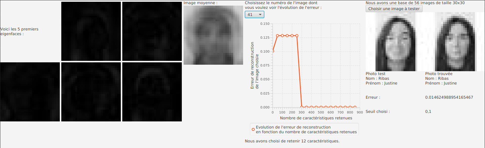

# Reconnaissance faciale par Analyse en Composantes Principales

## Introduction

Les dernières technologies connues visant à réaliser une reconnaissance faciale éfficace, utilisent des bases de deep learning et d’Intelligence Artificielle. Dans le cadre de ce projet, nous n’utiliserons pas ce systeme d’apprentissage, mais la méthode d’Analyse en Composantes Principales (ACP).
Nous avons réalisé ce projet en Java & JavaFX (pour l'interface) et nous avons utilisé une base d'apprentissage à partir de nos propores images.

## Manuel d'utilisation


Pour lancer le programme il faut avoir télécharger le dossier openjfx-18_linux-x64_bin-sdk
(https://gluonhq.com/products/javafx/)

Puis, il faut ouvrir un terminal à la racine du projet et saisir la commande suivante :

``` bash
java -jar --module-path /home/"votreCheminJusquaCeDossier"/openjfx-18_linux-x64_bin-sdk/javafx-sdk-18/lib --add-modules javafx.controls,javafx.fxml groupe10Livrable3.jar
```

Exemple :

``` bash
java -jar --module-path /home/cytech/Cours/ING1/ProgJava/IHM/openjfx-18_linux-x64_bin-sdk/javafx-sdk-18/lib --add-modules javafx.controls,javafx.fxml groupe10Livrable3.jar
```

Sur la machine de prod, le dossier openjfx-18_linux-x64_bin-sdk se trouve dans les répertoires /home/cytech/Cours/ING1/ProgJava/IHM/   , pour réutilisation, pensez bien à changer le chemin!

## Description

Une fois le programme lancé, une interface utilisateur s'ouvre et vous permet de visualiser  :
- les cinq premiers eigenfaces
- l'image moyenne
- l'évolution de l'erreur lors de la reconstruction de limage de votre choix
- le test de reconnaissance de l'image de votre choix. Pour cela, sélectionnez une image dans le dossier `Photo` (les images de test sont nommées avec le préfixe "T")

<p align="center"></p>
